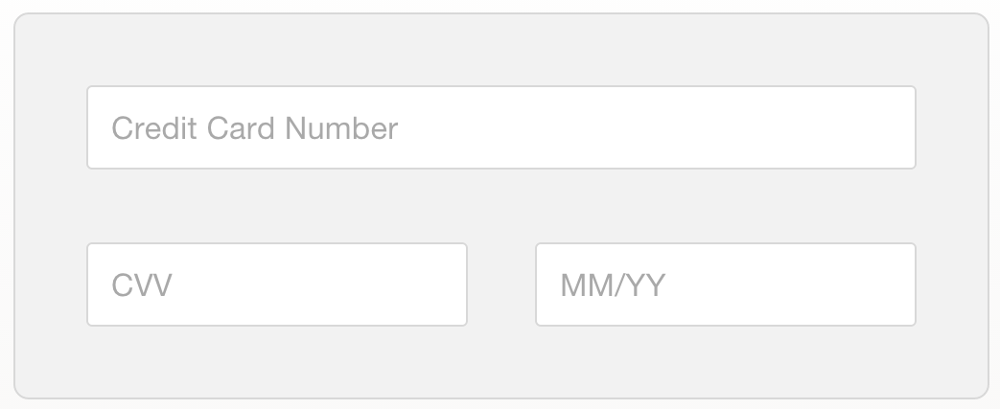
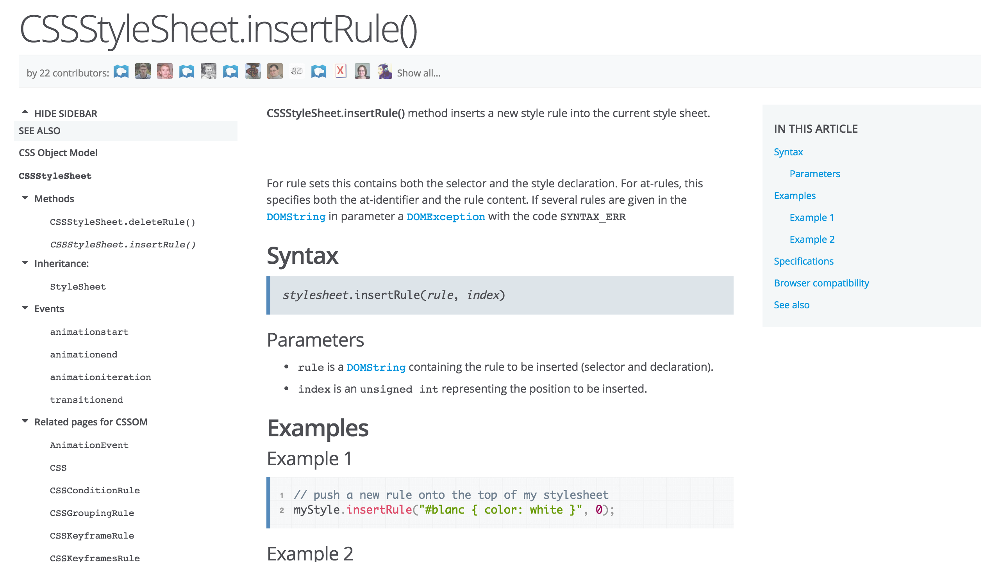
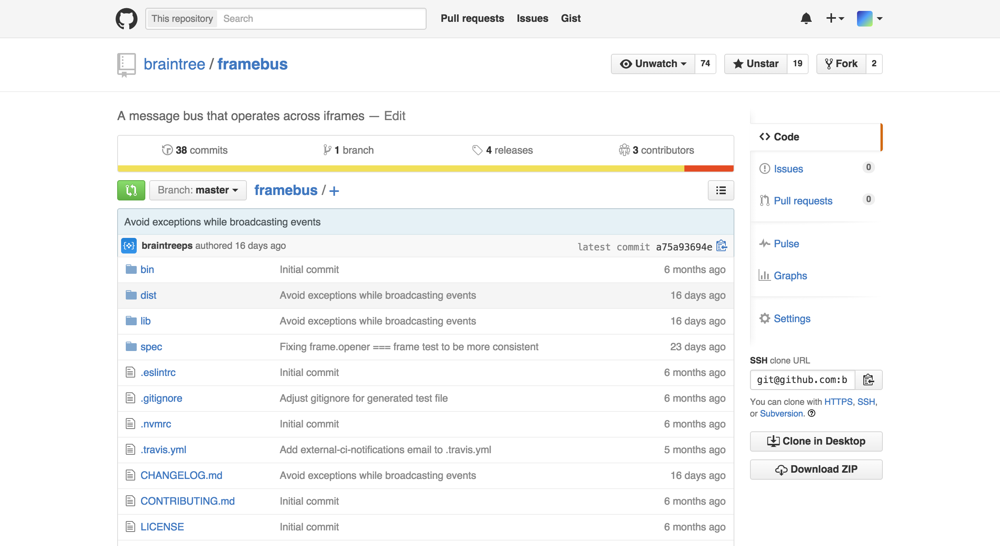
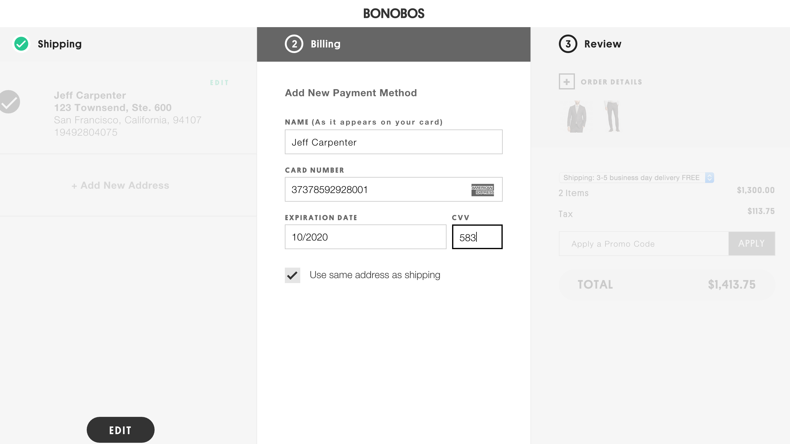
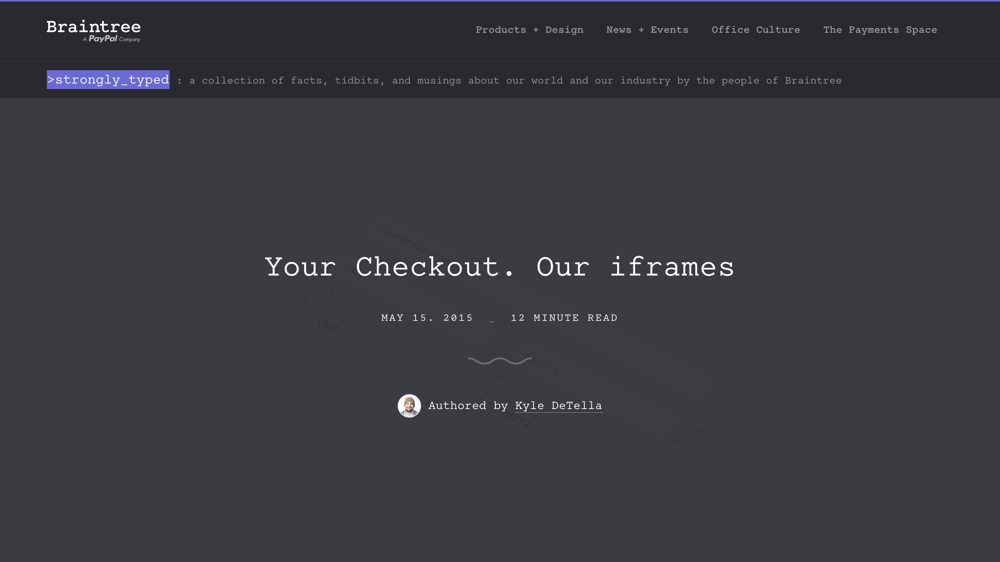

# Building Hosted Fields

Jeff Carpenter - @jcarp
Engineer at Braintree


---

# Disclaimer

This talk is:

- About front-end JS, not Node.js
- In English, not 日本語

---

- 大学の時にちょっと日本語を勉強しました

^ I studied a little bit of Japanese in school

- 日本大好き

^ I love Japan

- ねこあつめが好きですか？

^ Does anyone here like Neko Atsume?

---

Braintree helps companies like Uber, Airbnb, GitHub, and Dropbox accept credit cards, PayPal, Venmo, Bitcoin, Apple Pay, and Android Pay


---

# credit card forms

^ me and my teammates focus on credit card forms

---

Some background...

---

# PCI DSS

A set of rules that companies accepting credit cards must follow

---

# 2015 - PCI DSS version 3

Credit card information must now be entered on the domain of your payment provider

^ For the easiest level of compliance

---

# `<iframe>`

^ Now the most popular HTML element at the payments party

---

# Drop-in UI


---

# Drop-in UI: 👍

---

But what if the Drop-in UI doesn't match the style of your checkout form?


---

# Hosted Fields

---

## Hosted Fields: a new integration for matching the style of your checkout form _and_ being PCI compliant

^ Unfortunate disclaimer: Hosted Fields is not available in Japan

---

# Building Hosted Fields


---

We decided that the only way to give merchants the most customizability was to make each input an iframe

---

# Before

```html
<form name="credit-card>
  <input name="card-number" />
  <input name="cvv" />
  <input name="expiration" />
</form>
```

---

# After

```html
<form name="credit-card>
  <div name="card-number"></div>
  <div name="cvv"></div>
  <div name="expiration"></div>
</form>
```

^ Hosted Fields then inserts iframes into each

---

# Before



---

# After


---

How does the merchant style the iframes?

---


## Styling Considerations

- Guard against XSS
- Minimal change to existing CSS workflow
- Easy and intuitive

---

## Approaches we considered

---

## Infer styles from conatiner

- 👍 No extra work for the merchant
- 👎 Requires watching for updates
- 👎 Black box to the merchant

---

## `applyIf`

```js
styles: [
  { // base styles
    color: 'green', 
    fontFamily: 'Helvetica'
  },
  { // setting styles for focused elements
    applyIf: function(inputElement) { return inputElement.isFocused; },
    color: 'limegreen'
  },
  { // media queries
    applyIf: function() { return window.innerWidth > 600; },
    fontSize: '16pt'
  }
]
```

---

## `applyIf`

- 👍 Not constrained to CSS rules
- 👍 Anything you can write in JS works
- 👍 Supports media queries
- 👎 Not intuitive
- 👎 Requires inter-frame communication for every CSS change

---

## CSS in a script tag

```html
<script type="braintree/css">
  input {
    font-size: 16pt;
    color: #ccc;
  }
</script>
```

- 👍 Intuitive
- 👎 Requires parsing CSS in JS

---



---

## `stylesheet.insertRule`

```js
{
  'input': {
    'font-size': '16pt'
  }
}
```

Becomes:

```js
stylesheet.insertRule('input { font-size: 16pt; }');
```

---

## `stylesheet.insertRule`

- 👍 Close to CSS syntax
- 👍 Supports media queries
- 👍 Makes XSS more difficult

```js
{
  'input': {
    'font-size': '16pt'
  }
}
```

---

# Inner vs. Outer styles

---

# Outer styles: applied to the container

Like `border` or `background-color`


---

# Outer styles: applied to the container

```html
<div id="card-number"></div>

<style>
#card-number {
  background-color: white;
}
</style>
```

---

# Inner styles: for the text

Like `color` or `font-size`


---

# Inner styles: for the text

```js
braintree.setup('client-token', 'custom', {
  hostedFields: {
    styles: {
      'input': {
        'font-size': '16pt'
      },
      ':focus': {
        'color': '#ddd'
      }
    }
  }
});
```

---

## Media queries also supported

```js
braintree.setup('client-token', 'custom', {
  hostedFields: {
    styles: {
      '@media any': {
        'input': { /*...*/ }
      }
    }
  }
});
```

---

## Should we use a cool compile-to-JS language?

---

# We evaluated using TypeScript

```js
function sum(a: number, b: number): number {
  return a + b;
}
```

- Easy if your entire project is TypeScript
- Must write type declarations for all plain JS

---

# We also evaluated using Babel for ES6

- Vanilla JS™ on the merchant page
- Babel/ES6 inside iframes

---

# We also evaluated Jest

- Front-end testing framework from Facebook
- Based on jsdom (JS implementation of the DOM)
- Auto-mocks everything by default

```js
const API = require('api');
console.log(API);
// => {}
```

^ (?) Screenshot of jest?

---

### Ended up using Karma, PhantomJS, and Mocha for testing

---

## Merchant can no longer access credit card number

---

# How does validation work?

---

We thought of ways to expose information merchants need from the form, like events and validation

---

# Event Lifecycle

```js
hostedFields: {
  onFieldEvent: function (event) {
    if (event.type === "focus") {
      // Handle focus
    } else if (event.type === "blur") {
      // Handle blur
    } else if (event.type === "fieldStateChange") {
      // Handle a change in validation or card type
      console.log(event.isValid); // true|false
      if (event.card) {
        console.log(event.card.type);
        // visa|master-card|american-express|diners-club|discover|jcb|unionpay|maestro
      }
    }
  }
}
```

^ This is verbose, but we wanted to add really low-level validation for the merchant to use

---

# Incremental validation

---

# Validating as you type

```js
3    => {isValid: false, isPotentiallyValid: true,  type: null}
37   => {isValid: false, isPotentiallyValid: true,  type: 'Amex'}
373  => {isValid: false, isPotentiallyValid: true,  type: 'Amex'}
3736 => {isValid: false, isPotentiallyValid: false, type: null}

4111111111111111
     => {isValid: true,  isPotentiallyValid: true,  type: 'Visa'}
```

---


---

## How do the iframes talk to each other?

---

# Framebus

```html
<iframe>
  <script>
    bus.on('message', function (data) {
      console.log(data); // => 'こんにちは';
    });
  </script>
</iframe>

<iframe>
  <script>
    bus.emit('message', 'こんにちは');
  </script>
</iframe>
```

---



---

# Team dynamics

- 4 programmers (2 pairs)
- Pair programming 100% of the time
- Rotate pairs every few days

---



^ Screenshot of Bonobos Hosted Fields

---

Huge thanks to Kyle, Mrak, Evan, Rohit, Trevor, and everyone else who worked on Hosted Fields

^ (?) Would be cool: circle photos (like on blog) of each person (or regular square ones from team page)

---



^ For a much more detailed account, read this blog post by Kyle

---

Slides and links to everything: 

[https://github.com/jeffcarp/building-hosted-fields](https://github.com/jeffcarp/building-hosted-fields)

---

Let's talk about JS or payments - @jcarp

Thank you!! 

ありがとうございます！

