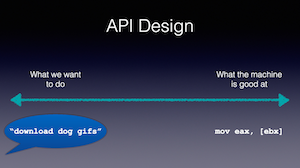

# talks

Notes and resources from talks I've given.

### [Design Principles Behind Smalltalk](2015-design-principles-behind-smalltalk)

I presented the paper _Design Principles Behind Smalltalk_ by Dan Ingalls at the Papers We Love Too meetup in SF. Object Oriented Programming is far from being a "hot new thing" these days (when I presented the paper, the term was met with ironic hisses and boos) -- but there are fundamental design principles that the creators of Smalltalk describe that can apply to any programming paradigm.

### [Building Hosted Fields](2015-building-hosted-fields)

A technical walkthrough of the challenges my team faced building Hosted Fields at Braintree. Hosted Fields is a new payment integration that lets merchants acheive PCI compliance while allowing their payment form to blend into the rest of their website. We did this by replacing each input field with an iframe.

### [Introduction to AngularJS](2014-intro-to-angularjs)
